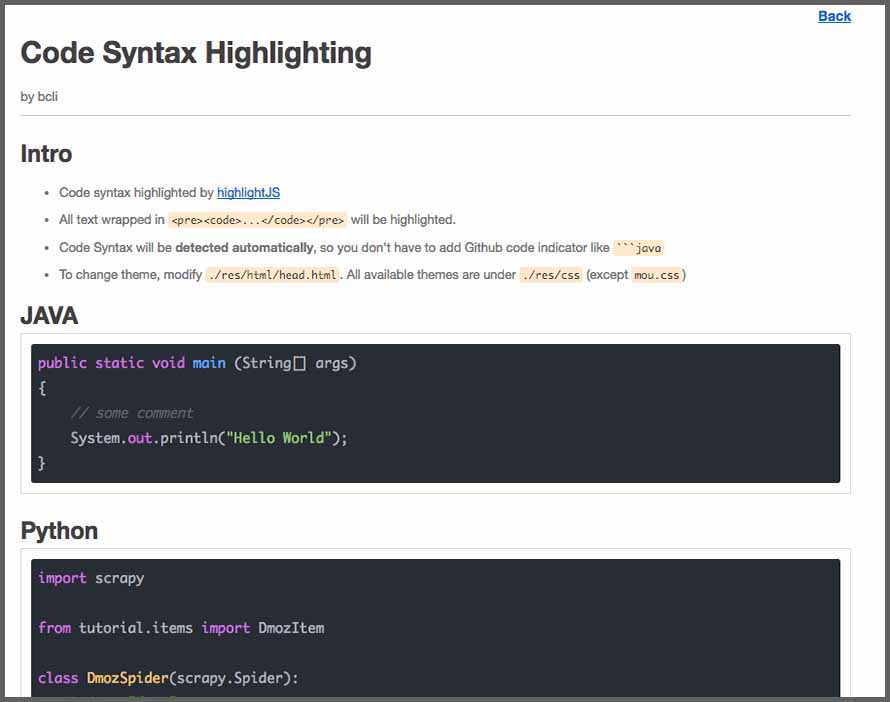

# Markdown Worm #

---

__v1.0.1__

A very simple markdown viewer implemented in PHP, [ParseDown](http://parsedown.org), [Mou](http://25.io/mou/)
and [HighlightJS](https://highlightjs.org/)

[中文版说明](README_CN.md)

## What is Markdown ?

Markdown is a lightweight markup language with plain text formatting syntax designed so that it can be converted to HTML and many other formats using a tool by the same name. Markdown is often used to format readme files, for writing messages in online discussion forums, and to create rich text using a plain text editor.

## Usage

Easy storing & sharing markdown files. Use your favorite Markdown editor (like Mou), then upload your md to server, 
grab a coffee and enjoy file list and automatic code highlighting. 

## Showcase
###1. Generated Markdown File List

###2. Markdown will be converted to html by [ParseDown](http://parsedown.org/)

###3. Code syntax will be auto-detected and highlighted by [Highlight.js](https://highlightjs.org/)

## Install

### Mac & Win

1. Install [XAMPP](https://www.apachefriends.org/index.html)
2. Download mdWorm release & Unzip it to `xampp/htdocs`
3. under XAMPP GUI, start Apache Server
4. Open browser and type `localhost/mdWorm`

### RHEL & CentOS

1. Install httpd

		sudo yum install httpd -y

2. Install PHP

		sudo yum install php -y

3. Download mdWorm & Unzip it to `/var/www/html`

		cd /var/www/html
		wget <mdWorm-release-tarball>
		tar -zxvf <mdWorm-release-tarball>

4. Start Apache Server

		service httpd start

5. Open browser and type

		localhost/mdWorm

### Debian & Ubuntu
1. Install apache2

		sudo apt-get install apache2

2. Install PHP

		sudo apt-get install php5 libapache2-mod-php5

3. Download mdWorm & and unzip to`/var/www/html`

		cd /var/www/html
		wget <mdWorm-release-tarball>
		tar -zxvf <mdWorm-release-tarball>

4. Start Apache Server

		service apache2 start

5. Open browser and type

		localhost/mdWorm

### MIT License

===
Beichen Li 2016-9-1
