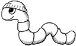
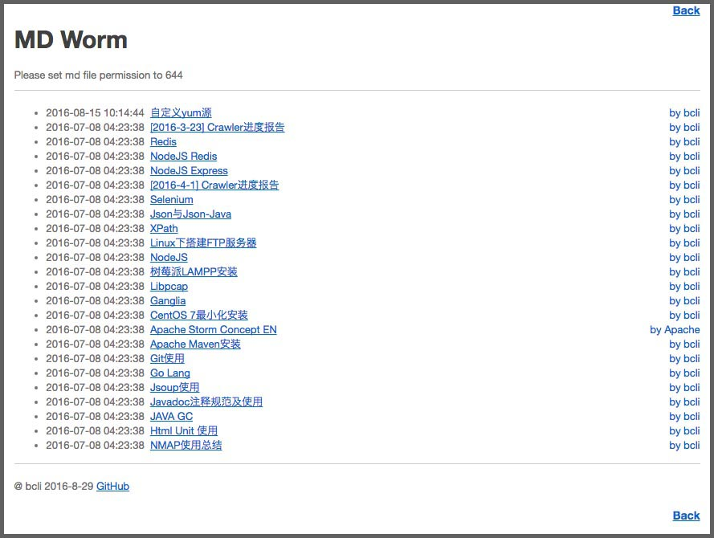
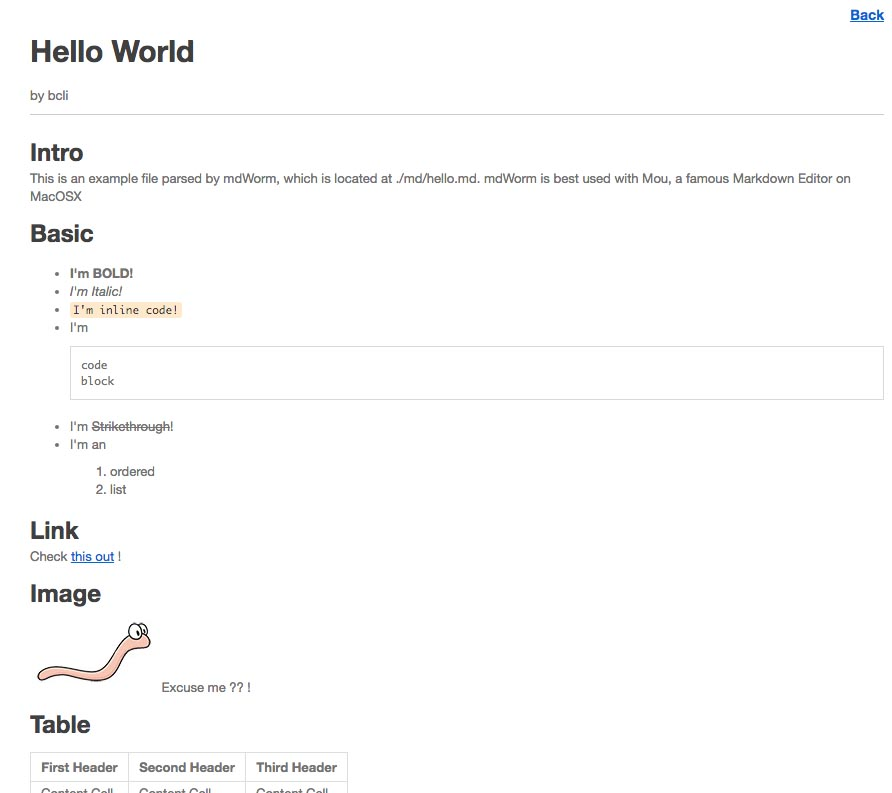

# MD Worm

---

A very simple markdown viewer implemented by PHP, [ParseDown](http://parsedown.org) and [Mou](http://25.io/mou/)

[中文版说明点这里](README_CN.md)

## What is Markdown ?

Markdown is a lightweight markup language with plain text formatting syntax designed so that it can be converted to HTML and many other formats using a tool by the same name. Markdown is often used to format readme files, for writing messages in online discussion forums, and to create rich text using a plain text editor.

BTW, this paragraph is written in Markdown too.

## Use Case

I use markdown everyday for writing technology & problem notes, but what is a easier way for you share them,
especially between colleages ? For example, someday Dave asks you 'Dude, have you ran into this problem before?

'Yes!' you say, 'I wrote a Markdown file about it, and it has been uploaded to my server at http://192.168.1.111/mdWorm'

'A FTP server ?' Dave asked.

'No!' you say, 'When you visit the page, the PHP code converts the markdown file to HTML for you so you don't have to download anything at all!'

## Showcase
###1. Markdown File List

###2. Converted by Parsedown and displayed by CSS from Mou

## Install

### Mac & Win

1. Install [XAMPP](https://www.apachefriends.org/index.html)

2. Download mdWorm & Unzip it to `xampp/htdocs`
3. under XAMPP GUI, start Apache Server
4. Open browser and type `localhost/mdWorm`

### RHEL & CentOS

1. Install httpd

		sudo yum install httpd

2. Install PHP

		sudo yum install php

3. Download mdWorm & Unzip it to `/var/www/html`

		cd /var/www/html
		wget <mdWorm-release-tarball>
		tar -zxvf <mdWorm-release-tarball>

4. Start Apache Server

		service httpd start

5. Open browser and type

		localhost/mdWorm

### Debian & Ubuntu
1. Install apache2

		sudo apt-get install apache2

2. Install PHP

		sudo apt-get install php5 libapache2-mod-php5

3. Download mdWorm & and unzip to`/var/www/html`

		cd /var/www/html
		wget <mdWorm-release-tarball>
		tar -zxvf <mdWorm-release-tarball>

4. Start Apache Server

		service apache2 start

5. Open browser and type

		localhost/mdWorm

### MIT License

===
Beichen Li 2016-8-29
