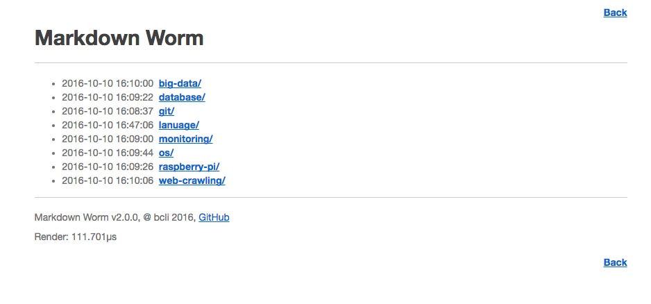
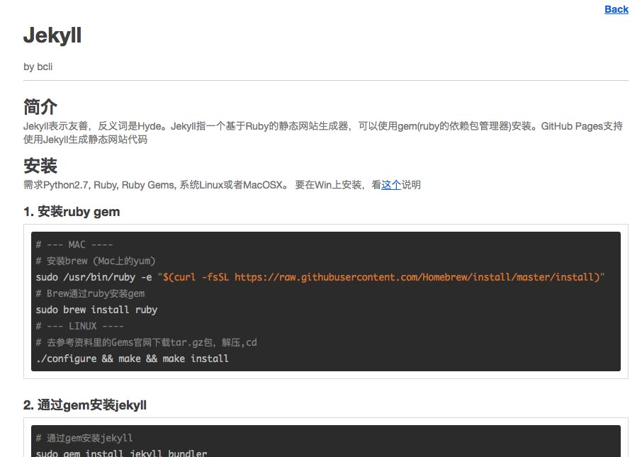
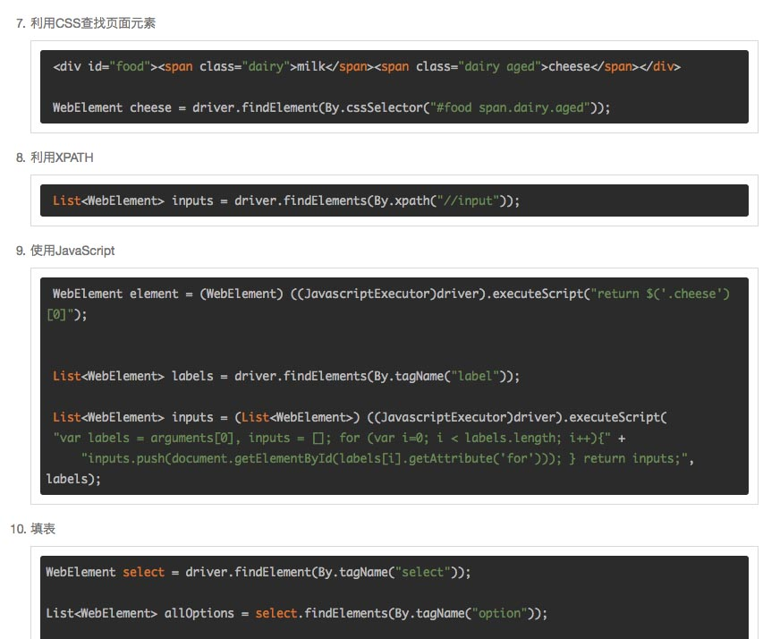

# Markdown Worm #

---

__v2.0.0__

GoLang Markdown浏览器, 基于[golang-commonmark/markdown](https://github.com/golang-commonmark/markdown), 
[Mou](http://25.io/mou/), 和 [HighlightJS](https://highlightjs.org/)

[English Version](README.md)

## 什么是Markdown ?

Markdown是一个轻量级标记语言，能够被轻易的转化为HTML或者PDF。Markdown经常被用来撰写readme文件，用来在论坛上发布消息，或者将简单的文本转化为复杂的表现形式。

## 像个男人一样~~十秒就射~~ 分享你的文件！

Markdown Worm一般部署在Linux服务器上，用于在公司内网或者博客上分享各种Markdown文档。它在显示时可以自动把你的Markdown转换成HTML，并且用Highlight.js自动
识别代码语法并高亮。

## v2.0.0变动

1. 用GoLang代替PHP，提升速度. 现在你可以直接部署编译后的代码了
2. 程序现在可以识别`./md`下的文件夹结构了
3. 暂时不支持Windows系统

## 朋友,你~~听说过安利吗~~要看看图片吗?

###1. 列出`./md`下的文件树

###2. Markdown文件自动转换成HTML,by[golang-commonmark/markdown](https://github.com/golang-commonmark/markdown)

###3.[Highlight.js](https://highlightjs.org/)语法高亮,图片里使用了`darcula`样式

## 注意

由于更换了新的Markdown解析器`golang-commonmark`，现在你必须把标题写成`# title #`或者`# title`,
否则会有解析错误

##  安装

### Mac & Linux

1. 下载解压

        cd /to/dir/
        # Mac
        wget https://github.com/bclicn/MarkdownWorm/releases/download/v2.0.0/mdworm-2.0.0-darwin.tar.gz
        tar zxvf mdworm-2.0.0-darwin.tar.gz

        # Linux
        wget https://github.com/bclicn/MarkdownWorm/releases/download/v2.0.0/mdworm-2.0.0-linux.tar.gz
        tar zxvf mdworm-2.0.0-linux.tar.gz
    
2. 运行
    
   		cd mdworm-2.0.0-*
   		./mdworm
   
3. 打开浏览器输入 `localhost:2333`

已测试过的系统: 最新版的OSX (用Mac写的), CentOS 6.5, 7

## 参数

使用 `-p`修改默认服务器端口2333, `-t`修改默认代码高亮样式`./public/css/default.css`。
全部高亮样式见`./public/css/`, 下面是参数使用举例:

    # 更改服务器端口为6666
    ./mdworm -p 6666
    # 更改代码高亮样式为 darcula
    ./mdworm -t darcula
    # 更改服务器端口为6666 并 更改代码高亮样式为 darcula
    ./mdworm -p 6666 -t darcula

如果你想让它以背景线程运行，在命令结尾加上`&`就好了，比如
	
	./mdworm -p 6666 -t darcula &

## MIT License
===
Beichen Li 2016-10-25
